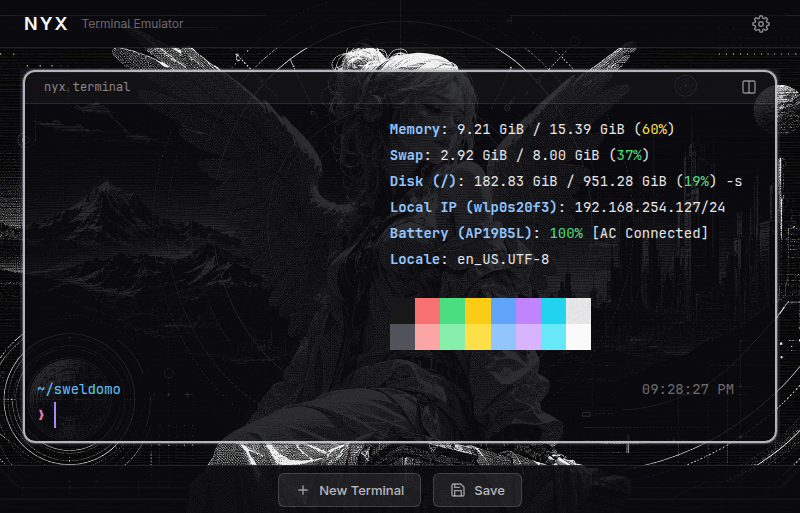

# Nyx

A web-based terminal emulator with i3-style tiling splits, Electron desktop app support, and a dark HUD aesthetic. Access your real terminal from the browser or as a native desktop application.



## Features

- **i3-Style Tiling Splits**: Split any terminal horizontally or vertically. Nested splits supported. Running apps (htop, nvim) survive splits — flat rendering with stable keys prevents component destruction.
- **Real PTY**: Full terminal emulation with node-pty — not a fake terminal
- **Split Inherits CWD**: Splitting a terminal opens the new one in the same directory via `/proc/<pid>/cwd` (Linux kernel, reliable)
- **Terminal Gaps**: Visual breathing room between terminals (configurable via GAP constant)
- **Terminal Renaming**: Click the title to rename. Names persist across sessions.
- **Active Terminal Glow**: Focused terminal gets a lighter border with purple glow
- **Opacity Control**: Settings gear in the navbar — slide to adjust terminal transparency
- **Copy/Paste**: Right-click to copy selection or paste. Ctrl+Shift+C/V shortcuts.
- **Session Persistence**: Terminals, layout tree, names, opacity — all saved and restored. Orphaned terminals cleaned on load.
- **Auto-Reconnect**: WebSocket disconnects trigger exponential backoff reconnect
- **4-Terminal Limit**: Max 4 terminals by design. Split and New Terminal buttons disabled at cap.
- **Security**: Server binds to 127.0.0.1 only, origin checking on WebSocket
- **Electron Ready**: Desktop app with tray icon, native integrations

## Installation

```bash
cd ~/Projects/nyx-terminal
npm install
```

## Usage

**Web Development:**
```bash
npm run dev
```

**Web Production:**
```bash
npm run build
npm start
```

**Electron Desktop App (Development):**
```bash
npm run electron:dev
```

**Electron Desktop App (Production):**
```bash
npm run electron
```

**Build Electron for Distribution:**
```bash
npm run electron:build
```

For web, open http://localhost:2800 in your browser.

## Keyboard Shortcuts

| Shortcut | Action |
|----------|--------|
| Ctrl+Shift+C | Copy selected text |
| Ctrl+Shift+V | Paste from clipboard |
| Right-click (with selection) | Copy to clipboard |
| Right-click (no selection) | Paste from clipboard |

## Splitting

- Click the **split icon** in any terminal's header to choose horizontal or vertical split
- The new terminal inherits the current working directory of the terminal it was split from
- Use the **New Terminal** button in the footer for a fresh terminal at home directory
- Close a terminal with the × button — the split collapses automatically

## Customization

Edit `src/components/TerminalPane.vue` to customize:
- Terminal colors (xterm theme)
- Font family and size
- Border styling and glow

Edit `src/components/Settings.vue` to customize:
- Opacity slider range and defaults
- Settings panel layout

Edit `src/App.vue` to customize:
- Split behavior and layout tree
- Session save/restore logic

Edit `electron/main.js` to customize Electron settings:
- Window size and behavior
- Tray menu configuration
- Native integrations

## Security

**Warning**: The web version gives full terminal access to anyone who can access the URL. The server binds to `127.0.0.1` only and checks WebSocket origins, but use behind a firewall or add authentication for production use.

The Electron desktop app runs locally and is not exposed to the network.

## Tech Stack

- **Backend**: Node.js + Express + node-pty + WebSocket
- **Frontend**: Vue 3 + Vite + xterm.js
- **Desktop**: Electron + electron-builder
- **Styling**: CSS with dark HUD theme, JetBrainsMono Nerd Font

## Project Structure

```
nyx-terminal/
├── server.js              # Express + WS + PTY server
├── electron/main.js       # Electron desktop wrapper
├── src/
│   ├── App.vue            # Root — layout tree, split logic, session
│   ├── main.js            # Vue app entry
│   ├── assets/styles.css  # Global styles, fonts, xterm overrides
│   ├── composables/
│   │   └── useSession.js  # Session save/load API
│   └── components/
│       ├── Banner.vue     # Top navbar with Nyx branding + settings gear
│       ├── Settings.vue   # Opacity slider dropdown
│       ├── TerminalPane.vue # xterm terminal + header + copy/paste
│       ├── SplitButton.vue  # Split dropdown (horizontal/vertical)
│       └── FooterBar.vue  # New Terminal + Save buttons
├── setAsides/             # Removed features kept for reference
│   ├── fileTree/          # File tree panel (removed from active UI)
│   ├── ResizablePanels.vue # Old resizable panels (replaced by flat rendering)
│   └── SplitNode.vue      # Old recursive layout (replaced by flat rendering)
└── public/
    ├── assets/            # Favicon, background image
    └── fonts/             # JetBrainsMono Nerd Font
```

## License

MIT
