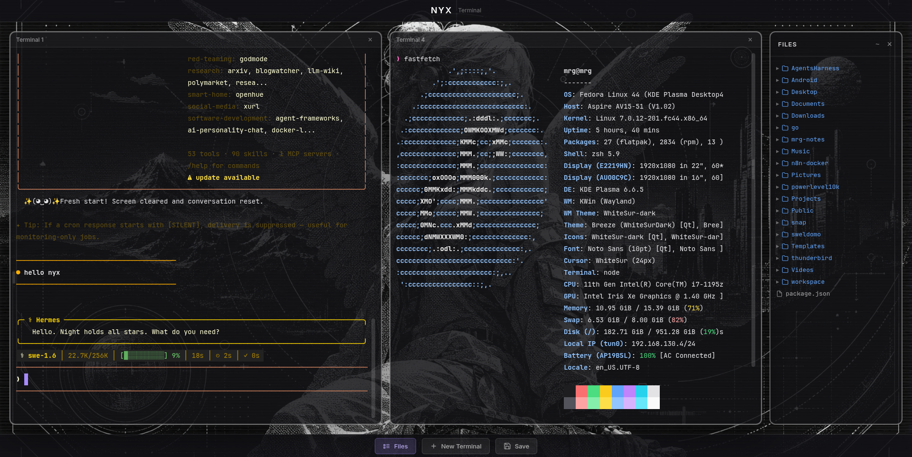

# Nyx

A web-based terminal with Hermes background. Access your real terminal from the browser with full filesystem access.



## Features

- **Real PTY**: Full terminal emulation with node-pty
- **HUD Background**: Dark theme with grid pattern and gradient beams (Hermes-style)
- **Neon Colors**: Cyan/green color scheme for that techy feel
- **Full Access**: Complete filesystem access from browser
- **Responsive**: Auto-resizes to fit window

## Installation

```bash
cd ~/Projects/web-terminal-hud
npm install
```

## Usage

```bash
npm start
```

Then open http://localhost:3000 in your browser.

## Customization

Edit `public/index.html` to customize:
- Background colors and gradients
- Grid pattern
- Terminal colors (xterm theme)
- HUD header styling

## Security

**Warning**: This gives full terminal access to anyone who can access the URL. Use behind a firewall or add authentication for production use.

## Tech Stack

- **Backend**: Node.js + Express + node-pty + WebSocket
- **Frontend**: @xterm/xterm + vanilla JS
- **Styling**: CSS with gradients and grid patterns
