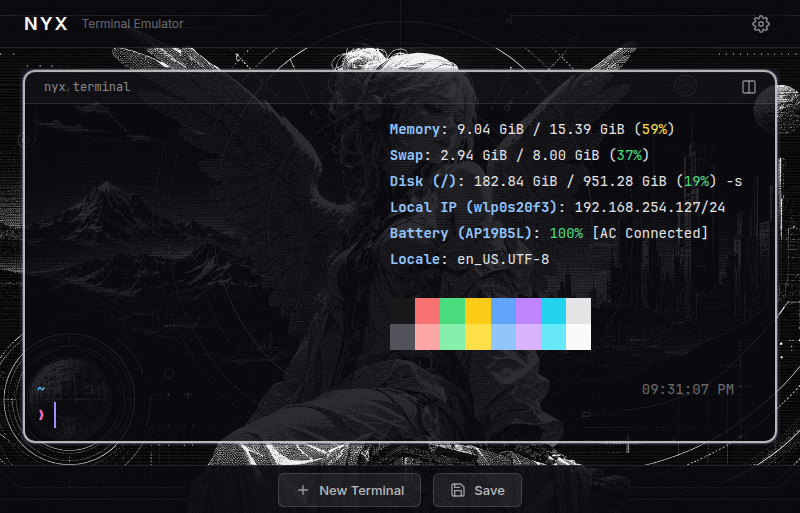
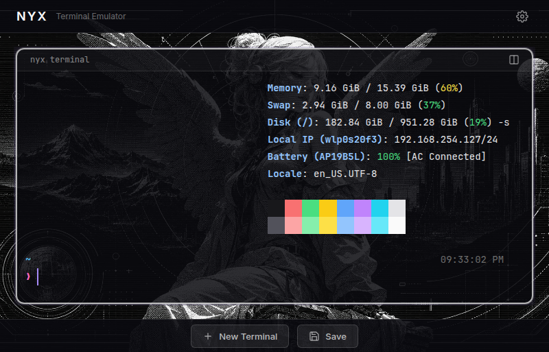
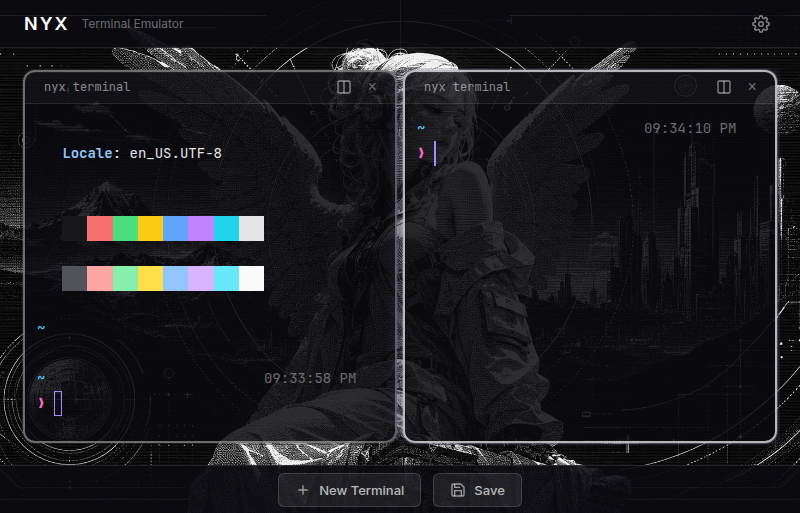
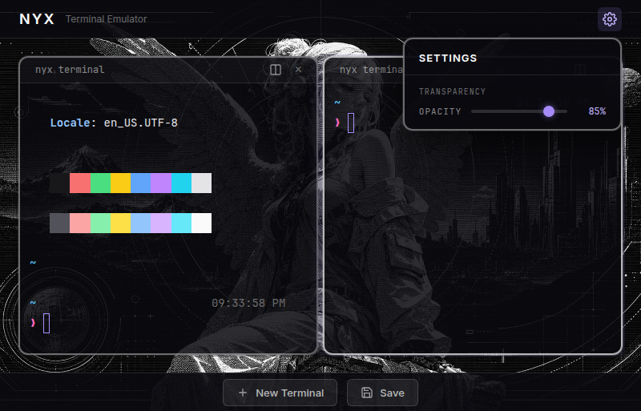

# Nyx

> A web-based terminal emulator with i3-style tiling splits. Real PTY, real apps, real workflows.

[](LICENSE)
[](#)
[](#)



## What is Nyx

Nyx is a terminal emulator that runs in your browser **and** as a native desktop app. It speaks to a real PTY — not a fake shell — so `htop`, `nvim`, `tmux`, and everything else you rely on just works. Split panes i3-style, and your running apps survive the split.

## Why Nyx

Most web terminals are demos. Nyx is built to be your daily driver.

- **Real PTY** — Full terminal emulation backed by `node-pty`. No fake shells, no shortcuts.
- **Apps survive splits** — Split a pane while `htop` is running. It keeps running. Flat rendering with stable keys means no component destruction.
- **i3-style tiling** — Horizontal and vertical splits, nested as deep as you need. Close a pane and the layout collapses cleanly.
- **Web + desktop** — Run it in the browser, or ship it as an Electron app with tray icon and native integrations.
- **Dark HUD aesthetic** — Deep blacks, purple accents, subtle glow on the focused pane. Built to look good and stay out of your way.
- **Session persistence** — Layout, names, opacity — all saved and restored on reload. Orphaned terminals cleaned up automatically.
- **Auto-reconnect** — WebSocket drops? Nyx reconnects with exponential backoff. Your session waits for you.

## Features

### Real PTY terminal



A genuine pseudo-terminal via `node-pty`. Every program that works in your local terminal works here.

### i3-style tiling splits



Split any pane horizontally or vertically, nest as deep as you like. Running apps keep running — the renderer uses stable keys so panes are never torn down and rebuilt.

### Opacity control



Slide the settings gear in the navbar to dial in terminal transparency. Persisted across sessions.

### And more

- **Terminal gaps** — Visual breathing room between panes (configurable)
- **Rename panes** — Click a title to rename. Names persist
- **Active pane glow** — Focused pane gets a lighter border with a purple glow
- **Copy / paste** — Right-click to copy or paste, or use `Ctrl+Shift+C` / `Ctrl+Shift+V`
- **4-pane cap** — Max four terminals by design. Keeps things focused
- **Electron desktop** — Tray icon, native integrations, runs locally

## Quick Start

```bash
git clone https://github.com/mrgonzales-dev/nyx-terminal.git
cd nyx-terminal
npm install
npm run dev
```

Then open **http://localhost:2800**.

Want the desktop app instead?

```bash
npm run electron:dev
```

## Usage

### Splitting panes

- Click the **split icon** in a pane's header to split horizontally or vertically
- Use **New Terminal** in the footer for a fresh pane at your home directory
- Close a pane with the × button — the layout collapses automatically

### Keyboard shortcuts

| Shortcut | Action |
|----------|--------|
| `Ctrl+Shift+C` | Copy selected text |
| `Ctrl+Shift+V` | Paste from clipboard |
| Right-click (with selection) | Copy to clipboard |
| Right-click (no selection) | Paste from clipboard |

### Running it

| Mode | Command |
|------|---------|
| Web (dev) | `npm run dev` |
| Web (prod) | `npm run build && npm start` |
| Electron (dev) | `npm run electron:dev` |
| Electron (prod) | `npm run electron` |
| Build for distribution | `npm run electron:build` |

## Customization

| What | Where |
|------|-------|
| Terminal colors, font, border, glow | `src/components/TerminalPane.vue` |
| Opacity slider range and defaults | `src/components/Settings.vue` |
| Split behavior and session logic | `src/App.vue` |
| Electron window, tray, native settings | `electron/main.js` |

## Tech Stack

- **Backend** — Node.js, Express, `node-pty`, WebSocket (`ws`)
- **Frontend** — Vue 3, Vite, xterm.js
- **Desktop** — Electron, electron-builder
- **Styling** — CSS, dark HUD theme, JetBrainsMono Nerd Font

## Project Structure

```
nyx-terminal/
├── server.js              # Express + WS + PTY server
├── electron/main.js       # Electron desktop wrapper
├── src/
│   ├── App.vue            # Root — layout tree, split logic, session
│   ├── main.js            # Vue app entry
│   ├── assets/styles.css  # Global styles, fonts, xterm overrides
│   ├── composables/
│   │   └── useSession.js  # Session save/load API
│   └── components/
│       ├── Banner.vue     # Top navbar with Nyx branding + settings gear
│       ├── Settings.vue   # Opacity slider dropdown
│       ├── TerminalPane.vue # xterm terminal + header + copy/paste
│       ├── SplitButton.vue  # Split dropdown (horizontal/vertical)
│       └── FooterBar.vue  # New Terminal + Save buttons
├── setAsides/             # Removed features kept for reference
│   ├── fileTree/          # File tree panel (removed from active UI)
│   ├── ResizablePanels.vue # Old resizable panels (replaced by flat rendering)
│   └── SplitNode.vue      # Old recursive layout (replaced by flat rendering)
└── public/
    ├── assets/            # Favicon, background image
    └── fonts/             # JetBrainsMono Nerd Font
```

## Security

**The web version gives full terminal access to anyone who can reach the URL.** The server binds to `127.0.0.1` only and checks WebSocket origins, but if you expose it, add authentication and put it behind a firewall.

The Electron desktop app runs locally and is not exposed to the network.

## License

MIT
